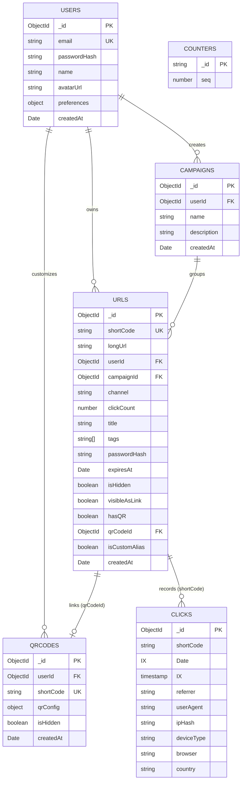

# Trimly Backend

> A high-performance, production-grade URL shortening and QR code management API featuring sub-50ms cached redirects, asynchronous BullMQ background processing, MongoDB transactions, and multi-channel campaign analytics.

[](https://nestjs.com/)
[](https://www.typescriptlang.org/)
[](https://www.mongodb.com/)
[](https://redis.io/)
[](https://docs.bullmq.io/)
[](https://swagger.io/)
[](https://jestjs.io/)
[](https://opensource.org/licenses/MIT)

**Live API**: [https://trimly-backend.onrender.com/api/docs](https://trimly-backend.onrender.com/api/docs) *(<!-- TODO: Replace with your live Render API URL if different -->)*  
**Frontend Repository**: [Trimly Frontend (Next.js 16 / React 19)](../trimly-frontend)

---

## Table of Contents

- [About the Project](#about-the-project)
- [Key Features](#key-features)
- [Tech Stack](#tech-stack)
- [Engineering Highlights](#engineering-highlights)
- [Database Schema Architecture](#database-schema-architecture)
- [API Documentation](#api-documentation)
- [Project Structure](#project-structure)
- [Getting Started](#getting-started)
  - [Prerequisites](#prerequisites)
  - [Installation](#installation)
  - [Environment Variables](#environment-variables)
  - [Running the Application](#running-the-application)
  - [Testing](#testing)
- [Deployment](#deployment)
- [Contributing](#contributing)
- [License](#license)
- [Author & Contact](#author--contact)

---

## About the Project

**Trimly** is a modern, full-featured link management and branded QR generation platform built from the ground up to reflect real-world, enterprise-grade architecture. Rather than relying on simplistic CRUD patterns, Trimly addresses genuine distributed systems challenges: sub-50ms redirect latencies, non-blocking click-stream telemetry, transactional integrity across relational graph models in document stores, and robust worker task scheduling within cloud resource limits.

The backend is built with **NestJS 11** and **TypeScript**, following strict modular Domain-Driven Design (DDD) principles. It handles authentication, URL lifecycle management, Base62 token generation, server-authoritative vector QR code rendering, multi-channel marketing campaigns, and click-stream analytics aggregation.

Trimly centers around **four core functional pillars**:
1. **Links**: Lightning-fast URL shortening via Base62 auto-increment tokens or custom aliases, complete with UTM parameter injection, password protection, expiration timestamps, and tag management.
2. **QR Codes**: Server-authoritative SVG/PNG generator engine featuring custom dot matrices, corner eyes, color palettes, center branding logos, and dynamic link binding.
3. **Campaigns**: Multi-channel marketing campaign aggregator that groups tracked links by distribution channel (Email, Social, SMS, Ads) to compute aggregate attribution metrics.
4. **Analytics**: Asynchronous, privacy-first telemetry pipeline logging IP geolocation, user agents, referrers, device platforms, and historical timeline trends without blocking end-user redirects.

---

## Key Features

### ⚡ Core Redirection & Link Lifecycle
- **Sub-50ms Redirect Pipeline**: Redis cache-first lookup on `GET /:code` bypassing database overhead on the hot path.
- **Base62 Sequential Token Generator**: Atomic MongoDB counter allocation transformed into short Base62 identifiers (`62^6` combinations for 6-character codes).
- **Custom Back-Half Aliases & Clones**: Custom slug reservations with collision detection and server-side source-cloning for back-half iterations.
- **Password-Protected Links**: Bcrypt-hashed password gating on protected short links with rate-limited credential validation.
- **Link Expiration Engine**: Configurable TTL expiration with automated 404 responses for expired links.
- **Bulk Operations**: Multi-link tagging, tag stripping, and bulk hiding/unhiding in single atomic operations.

### 🎨 Branded QR Code Studio
- **Server-Authoritative Rendering**: Server-side vector SVG and high-resolution raster PNG (1000x1000px) generation using `node-canvas` and `jsdom`.
- **Custom Design Patterns**: Multiple dot styles (`square`, `dots`, `rounded`, `classy`, `extra-rounded`), corner square styles, corner dot styles, and color combinations.
- **Branded Center Logos & Contrast Validation**: Automatic Error Correction Level escalation to `Level H` (30% recovery) when embedding center logos.
- **Scoped SVG Namespacing**: Dynamic SVG element ID scoping (`id="pattern_{shortCode}"`) to avoid gradient and mask collisions in multi-QR DOM lists.
- **QR Design Duplication**: Duplicate design configurations across short codes seamlessly.

### 📊 Asynchronous Telemetry & Analytics
- **Non-Blocking Telemetry Ingestion**: Click events dispatched to BullMQ queues without delaying HTTP 302 redirects.
- **Privacy-Preserving Hashing**: Client IPs are hashed via SHA-256 with country-level geo-resolution via `geoip-lite`.
- **User-Agent Classification**: Device type (`Desktop`, `Mobile`, `Tablet`) and browser engine identification via `ua-parser-js`.
- **Aggregated Metric Dimensions**: Time-series clicks, top referrers, device breakdowns, browser distributions, and geographic hot-spots.

### 📁 Campaigns & Attribution
- **Channel-Level Grouping**: Organize links by marketing channels (`email`, `social`, `sms`, `ads`, `other`).
- **Attribution Aggregation**: MongoDB aggregation pipeline computing total clicks and performance across channels with a 120s Redis cache buffer.

### 🛡️ Security & Account Lifecycle
- **JWT Authentication**: Passport-JWT authentication with Bearer token validation and `httpOnly` cookie support.
- **Brute-Force Rate Limiting**: Global and per-route rate limiting via `@nestjs/throttler` (e.g. 10 attempts/min on password verification).
- **Asynchronous Data Export**: Background BullMQ worker bundling complete user records, campaigns, links, and click history into downloadable JSON.
- **Asynchronous Cascade Deletion**: Background worker ensuring full cascade deletion across users, links, QR codes, campaigns, and Redis cache keys.

---

## Tech Stack

| Layer | Technology | Purpose |
| :--- | :--- | :--- |
| **Runtime & Framework** | [NestJS 11](https://nestjs.com/) | Enterprise Node.js TypeScript framework providing modular IoC architecture |
| **Language** | [TypeScript 5](https://www.typescriptlang.org/) | Static typing, decorators, and compile-time contract safety |
| **Primary Database** | [MongoDB](https://www.mongodb.com/) / [Mongoose 9](https://mongoosejs.com/) | Document database for URLs, campaigns, QR codes, users, and clicks |
| **Cache & Key-Value Store** | [Redis](https://redis.io/) / [ioredis 5](https://github.com/redis/ioredis) | Sub-millisecond cache layer for redirects, QR SVGs, and campaign rollups |
| **Job Queue & Workers** | [BullMQ 5](https://docs.bullmq.io/) / [@nestjs/bullmq](https://github.com/nestjs/bullmq) | Redis-backed asynchronous message queues for telemetry and heavy jobs |
| **Authentication & Crypto** | [Passport-JWT](http://www.passportjs.org/) / [bcrypt 6](https://github.com/kelektiv/node.bcrypt.js) | Stateless JWT bearer authentication and salted password hashing |
| **Image & Vector Engine** | [node-canvas 3](https://github.com/Automattic/node-canvas) / [JSDOM](https://github.com/jsdom/jsdom) | Headless canvas and DOM runtime for server-side QR SVG/PNG rendering |
| **QR Code Engine** | [qr-code-styling-node](https://github.com/qr-code-styling/qr-code-styling) | Server-side QR matrix generation with customizable styling primitives |
| **Telemetry Parsing** | [ua-parser-js 2](https://github.com/faisalman/ua-parser-js) / [geoip-lite 2](https://github.com/bluesmoon/node-geoip) | User-Agent device/browser parsing and fast local IP geo-resolution |
| **Validation & Schema** | [class-validator](https://github.com/typestack/class-validator) / [Joi 18](https://joi.dev/) | Incoming request DTO validation pipes and environment variable verification |
| **API Documentation** | [Swagger / OpenAPI 3](https://swagger.io/) | Auto-generated interactive REST API documentation and schema explorer |
| **Testing** | [Jest 30](https://jestjs.io/) / [Supertest 7](https://github.com/ladjs/supertest) | Unit testing, mock integration testing, and end-to-end HTTP validation |

---

## Engineering Highlights

### 1. Redis for Sub-50ms Redirect Latency
- **The Problem**: A URL shortener's primary hot path is `GET /:code`. Querying MongoDB on every inbound click introduces disk I/O, connection pool contention, and query parsing overhead that can easily push latency to 100ms+.
- **The Solution**: Trimly implements a cache-first read strategy. Inbound requests query Redis via `ioredis` using the key `url:{shortCode}`. A cache hit returns the target long URL in under 2ms.
- **Active Cache Invalidation**: To prevent stale redirects when users edit a link target, change password settings, or delete a URL, every mutating operation (`PATCH /api/urls/:code`, `DELETE /api/urls/:code`, bulk updates) triggers explicit `redis.del("url:{shortCode}")` calls.

### 2. Asynchronous Job Processing & Free-Tier Worker Resilience
- **The Problem**: Logging click metrics (user-agent parsing, IP geo-lookup, DB write, atomic counter increment) inside the HTTP request loop degrades redirect response times. Furthermore, platform deployments on free tiers (such as Render) do not permit standalone Background Worker services without paid tiers.
- **The Solution**: Telemetry logging, data exports, and account deletions are pushed to dedicated BullMQ queues (`clicks`, `export-user-data`, `delete-user-account`). 
- **Free-Tier In-Process Worker & Cron Draining**: The backend dynamically mounts worker processors in-process when `WORKER_ENABLED=true`. To counter Render free-tier instance idling (spin-down after 15 minutes of inactivity), a lightweight `/api/health` probe endpoint is pinged by an external uptime cron. This guarantees instances wake up and worker queues drain reliably.

### 3. MongoDB Multi-Document Transactions for Atomic QR Creation
- **The Problem**: Creating a QR code is a multi-document operation involving two distinct collections: inserting or updating a backing `Url` document in `urls`, and creating the corresponding styling record in `qrcodes`. If the QR record creation fails halfway through, orphaned URL entries would corrupt the user's dashboard.
- **The Solution**: `QrCodesService.createQrCode()` opens a native MongoDB Client Session transaction (`session.startTransaction()`). The backing URL creation/update and the QR document persistence are committed atomically. If any constraint fails, `session.abortTransaction()` ensures zero database inconsistency.

### 4. Researched Link ↔ QR Relationship Model (`visibleAsLink`, `hasQR`, `qrCodeId`)
- **The Problem**: A naive 1:1 relationship between links and QR codes fails real-world requirements (e.g. creating a standalone QR code shouldn't clutter the primary Links table, but a user must be able to convert that QR into a visible link later or attach a QR to an existing link).
- **The Solution**: Modeled after industry standards (Bitly), Trimly decouples link visibility from QR presence:
  - `visibleAsLink: true, hasQR: false`: Standard short link.
  - `visibleAsLink: false, hasQR: true`: Standalone QR code (hidden from Links list, visible in QR Studio).
  - `visibleAsLink: true, hasQR: true`: Linked QR code (accessible and editable in both views).
  - `visibleAsLink: true, hasQR: false (promoted)`: Standalone QR promoted to full link via `POST /api/urls/:code/promote-to-link`.

### 5. Multi-Layer Security & Defense-in-Depth
- **Cryptographic Hashing**: User account passwords and password-protected link secrets use salted Bcrypt hashing (`bcrypt.hash(password, 10)`).
- **Rate-Limited Protected Surfaces**: The `POST /api/urls/:code/verify-password` endpoint is throttled using `@nestjs/throttler` to 10 requests per minute per IP to prevent brute-force attacks against link passwords.
- **Strict Ownership Verification**: Every mutation (`PATCH`, `DELETE`, bulk update) enforces tenant validation comparing the authenticated JWT `userId` against document ownership, preventing IDOR (Insecure Direct Object Reference) vulnerabilities.

---

## Database Schema Architecture

Trimly utilizes a clean MongoDB collection design optimized for indexing, quick lookup, and aggregation pipelines:



### Collections Overview
- **`users`**: User identity, credential hashes, profile metadata, and notification/theme preferences.
- **`urls`**: Core short link documents containing routing targets, Base62 codes, UTM tags, visibility flags, and password hashes.
- **`qrcodes`**: Customized QR styling configurations (dots style, corner styles, colors, logo URLs).
- **`campaigns`**: Marketing campaign containers for multi-channel link attribution.
- **`clicks`**: Raw telemetry click-stream events ingested asynchronously by BullMQ.
- **`counters`**: Atomic sequence counter (`_id: 'urlCounter'`) for auto-increment Base62 token generation.

---

## API Documentation

Interactive Swagger OpenAPI 3.0 documentation is served at `/api/docs` when the server is running.

### Key Endpoints Quick Reference

| Module | Method | Endpoint | Description | Auth |
| :--- | :--- | :--- | :--- | :--- |
| **Redirect** | `GET` | `/:code` | Hot-path cache-first 302 redirect & click enqueue | Public |
| **Auth** | `POST` | `/api/auth/register` | Register new user account | Public |
| | `POST` | `/api/auth/login` | Authenticate and obtain JWT token | Public |
| | `GET` | `/api/auth/me` | Fetch authenticated user profile | Bearer JWT |
| **URLs** | `POST` | `/api/urls` | Create short link (auto-generated or custom alias) | Optional JWT |
| | `GET` | `/api/urls` | List user links (with tag, type, & QR filters) | Bearer JWT |
| | `GET` | `/api/urls/tags` | Get distinct tags used across links | Bearer JWT |
| | `GET` | `/api/urls/:code` | Get metadata for a short URL | Public |
| | `PATCH` | `/api/urls/:code` | Update long URL, expiration, or tags | Bearer JWT |
| | `DELETE` | `/api/urls/:code` | Delete link and cascade-delete attached QR | Bearer JWT |
| | `POST` | `/api/urls/:code/verify-password` | Validate password for protected link (rate-limited) | Public |
| | `POST` | `/api/urls/:code/promote-to-link` | Promote QR-only URL to visible link | Bearer JWT |
| | `POST` | `/api/urls/:code/edit-back-half` | Clone link to new custom alias | Bearer JWT |
| | `PATCH` | `/api/urls/bulk-tags` | Bulk add or remove tags across links | Bearer JWT |
| | `PATCH` | `/api/urls/bulk-hide` | Bulk hide/unhide links | Bearer JWT |
| **QR Codes** | `POST` | `/api/qrcodes` | Create/update custom styled QR code | Bearer JWT |
| | `GET` | `/api/qrcodes` | List user QR codes with filters | Bearer JWT |
| | `GET` | `/api/qrcodes/:code` | Get rendered QR image (SVG default, PNG on demand) | Bearer JWT |
| | `GET` | `/api/qrcodes/:code/details` | Get single QR configuration and backing URL | Bearer JWT |
| | `POST` | `/api/qrcodes/:code/duplicate`| Duplicate QR styling to another target short code | Bearer JWT |
| | `PATCH` | `/api/qrcodes/:code` | Update QR properties (e.g. visibility) | Bearer JWT |
| | `DELETE` | `/api/qrcodes/:code` | Delete QR code configuration | Bearer JWT |
| **Campaigns**| `POST` | `/api/campaigns` | Create marketing campaign | Bearer JWT |
| | `GET` | `/api/campaigns` | List user campaigns with aggregated stats | Bearer JWT |
| | `GET` | `/api/campaigns/:id` | Get campaign details & channel-level link stats | Bearer JWT |
| | `PATCH` | `/api/campaigns/:id` | Update campaign name or description | Bearer JWT |
| | `DELETE` | `/api/campaigns/:id` | Delete campaign and unlink associated URLs | Bearer JWT |
| **Analytics**| `GET` | `/api/analytics` | Overall account click metrics & time-series | Bearer JWT |
| | `GET` | `/api/analytics/:code` | Detailed analytics breakdown for a single link | Public |
| **Users** | `PATCH` | `/api/users/profile` | Update user display name & avatar URL | Bearer JWT |
| | `PATCH` | `/api/users/preferences`| Update user preferences (theme, timezone) | Bearer JWT |
| | `POST` | `/api/users/change-password` | Change account password | Bearer JWT |
| | `GET` | `/api/users/export-data` | Enqueue background job to export user data JSON | Bearer JWT |
| | `GET` | `/api/users/export-data/:jobId` | Poll export job status and download payload | Bearer JWT |
| | `DELETE` | `/api/users/account` | Enqueue background job for cascade account deletion | Bearer JWT |
| **Health** | `GET` | `/api/health` | Service health probe (MongoDB & Redis ping) | Public |

---

## Project Structure

```text
trimly-backend/
├── src/
│   ├── common/                                      # Shared cross-cutting modules, utilities, & guards
│   │   ├── decorators/                              # Custom parameter and route decorators
│   │   │   ├── get-user.decorator.ts                # Extracts authenticated user payload from request
│   │   │   └── public.decorator.ts                  # Marks endpoints as publicly accessible
│   │   ├── filters/                                 # Global exception handling
│   │   │   └── http-exception.filter.ts             # Standardized JSON error response formatter
│   │   ├── guards/                                  # Authentication and route security guards
│   │   │   ├── jwt-auth.guard.ts                    # Enforces valid Bearer JWT tokens
│   │   │   └── optional-jwt-auth.guard.ts           # Optional JWT extractor for anonymous/authenticated flows
│   │   ├── interceptors/                            # Request/response interceptors
│   │   │   └── logging.interceptor.ts               # Request duration timing and HTTP logging
│   │   ├── redis/                                   # Redis client connection module
│   │   │   ├── redis.module.ts                      # Global Redis NestJS module
│   │   │   └── redis.provider.ts                    # ioredis client factory provider token
│   │   └── utils/                                   # General utility functions
│   │       ├── base62.util.spec.ts                  # Base62 encoder/decoder unit tests
│   │       └── base62.util.ts                       # Base62 conversion algorithm for sequential numeric IDs
│   ├── config/                                      # Configuration loaders & Joi validation schemas
│   │   ├── configuration.ts                         # Environment variable mapping function
│   │   ├── database.config.ts                       # Mongoose connection options factory
│   │   ├── redis.config.ts                          # Dynamic Redis/Upstash connection provider
│   │   └── validation.schema.ts                     # Joi validation schema for environment variables
│   ├── database/                                    # Database schemas
│   │   └── counter.schema.ts                        # Atomic sequence counter schema for Base62 tokens
│   ├── modules/                                     # Domain feature modules
│   │   ├── analytics/                               # Click analytics and telemetry aggregations
│   │   │   ├── schemas/                             # Analytics document schemas
│   │   │   │   └── click.schema.ts                  # Raw click-stream event schema (IP hash, device, geo)
│   │   │   ├── analytics.controller.ts              # Overall and per-link analytics REST endpoints
│   │   │   ├── analytics.module.ts                  # Analytics module definition
│   │   │   ├── analytics.service.spec.ts            # Analytics service unit tests
│   │   │   └── analytics.service.ts                 # Aggregation pipelines for time-series and breakdowns
│   │   ├── auth/                                    # Authentication and user registration
│   │   │   ├── dto/                                 # Data transfer objects
│   │   │   │   ├── login.dto.ts                     # Login credentials request validation schema
│   │   │   │   └── register.dto.ts                  # Account registration request validation schema
│   │   │   ├── strategies/                          # Passport strategies
│   │   │   │   └── jwt.strategy.ts                  # Passport-JWT token validation strategy
│   │   │   ├── auth.controller.ts                   # Login, register, and /me profile endpoints
│   │   │   ├── auth.module.ts                       # Auth module definition and JWT configuration
│   │   │   ├── auth.service.spec.ts                 # Auth service unit tests
│   │   │   └── auth.service.ts                      # Bcrypt password comparison and JWT token issuance
│   │   ├── campaigns/                               # Marketing campaigns and multi-channel attribution
│   │   │   ├── dto/                                 # Data transfer objects
│   │   │   │   ├── create-campaign.dto.ts           # Campaign creation payload validation
│   │   │   │   └── update-campaign.dto.ts           # Campaign update payload validation
│   │   │   ├── schemas/                             # Campaign document schemas
│   │   │   │   └── campaign.schema.ts               # Campaign document schema (name, description, user)
│   │   │   ├── campaigns.controller.ts              # Campaign CRUD & channel aggregation endpoints
│   │   │   ├── campaigns.module.ts                  # Campaigns module definition
│   │   │   ├── campaigns.service.spec.ts            # Campaigns service unit tests
│   │   │   └── campaigns.service.ts                 # Aggregated stats calculation with 120s Redis cache
│   │   ├── health/                                  # Health check & uptime monitoring
│   │   │   ├── health.controller.ts                 # Health probe endpoint for MongoDB and Redis status
│   │   │   └── health.module.ts                     # Health module definition
│   │   ├── qrcodes/                                 # QR Code studio, styling, and vector rendering
│   │   │   ├── dto/                                 # Data transfer objects
│   │   │   │   ├── create-qrcode.dto.ts             # QR configuration creation payload
│   │   │   │   ├── duplicate-qrcode.dto.ts          # QR design duplication payload
│   │   │   │   └── update-qrcode.dto.ts             # QR visibility update payload
│   │   │   ├── schemas/                             # QR code document schemas
│   │   │   │   └── qrcode.schema.ts                 # QR styling schema (dots, corners, colors, logo)
│   │   │   ├── qrcodes.controller.ts                # QR generation, fetch SVG/PNG, and duplicate endpoints
│   │   │   ├── qrcodes.module.ts                    # QR codes module definition
│   │   │   ├── qrcodes.service.spec.ts              # QR codes service unit tests
│   │   │   └── qrcodes.service.ts                   # node-canvas/jsdom SVG/PNG render engine with caching
│   │   ├── queue/                                   # BullMQ async job queues and worker processors
│   │   │   ├── click.processor.ts                   # Worker processor for user-agent parsing and geo-lookup
│   │   │   ├── click.queue.ts                       # BullMQ producer for click events
│   │   │   ├── delete-user-account.processor.ts     # Worker processor for cascade account purge
│   │   │   ├── export-user-data.processor.ts        # Worker processor for data export JSON generation
│   │   │   ├── queue.module.ts                      # BullMQ dynamic module with in-process worker toggles
│   │   │   ├── user-delete.queue.ts                 # BullMQ producer for account deletion jobs
│   │   │   └── user-export.queue.ts                 # BullMQ producer for account data export jobs
│   │   ├── redirect/                                # Hot-path URL redirection engine
│   │   │   ├── redirect.controller.ts               # Root redirection controller
│   │   │   ├── redirect.module.ts                   # Redirect module definition
│   │   │   ├── redirect.service.spec.ts             # Redirect service unit tests
│   │   │   └── redirect.service.ts                  # Cache-first Redis lookup & BullMQ click dispatch
│   │   ├── url/                                     # Short URL management and lifecycle
│   │   │   ├── dto/                                 # Data transfer objects
│   │   │   │   ├── bulk-hide.dto.ts                 # Bulk hide/unhide links request payload
│   │   │   │   ├── bulk-tags.dto.ts                 # Bulk add/remove tags request payload
│   │   │   │   ├── create-url.dto.ts                # URL creation payload (longUrl, customAlias, UTM)
│   │   │   │   ├── edit-back-half.dto.ts            # Custom back-half alias cloning payload
│   │   │   │   ├── update-url.dto.ts                # URL update payload (target, expiry, tags)
│   │   │   │   └── verify-password.dto.ts           # Password verification payload for protected links
│   │   │   ├── schemas/                             # URL document schemas
│   │   │   │   └── url.schema.ts                    # Short URL schema (shortCode, longUrl, tags, UTM, auth)
│   │   │   ├── url.controller.ts                    # URL CRUD, bulk tags/hide, and password endpoints
│   │   │   ├── url.module.ts                        # URL module definition
│   │   │   ├── url.service.spec.ts                  # URL service unit tests
│   │   │   └── url.service.ts                       # Base62 allocation, link lifecycle, and Redis invalidation
│   │   └── users/                                   # User account management and preferences
│   │       ├── dto/                                 # Data transfer objects
│   │       │   ├── change-password.dto.ts           # Password change request validation
│   │       │   ├── delete-account.dto.ts            # Account deletion confirmation payload
│   │       │   ├── update-preferences.dto.ts        # Theme and timezone preference payload
│   │       │   └── update-profile.dto.ts            # Profile name and avatar update payload
│   │       ├── schemas/                             # User document schemas
│   │       │   └── user.schema.ts                   # User account schema with password serialization filter
│   │       ├── users.controller.ts                  # Profile, preferences, password, export, & delete endpoints
│   │       ├── users.module.ts                      # Users module definition
│   │       └── users.service.ts                     # User persistence, export scheduling, and deletion
│   ├── app.controller.spec.ts                       # App root controller unit tests
│   ├── app.controller.ts                            # Root greeting controller
│   ├── app.module.ts                                # Root application module registering dependencies
│   ├── app.service.ts                               # App root service
│   └── main.ts                                      # Bootstrap entrypoint, middleware, Swagger, CORS setup
├── test/                                            # End-to-end (E2E) integration test suites
│   ├── app.e2e-spec.ts                              # HTTP root and redirection E2E tests
│   ├── jest-e2e.json                                # Jest E2E configuration settings
│   └── qrcodes.e2e-spec.ts                          # QR Code generation and export E2E tests
├── .env.example                                     # Environment variables configuration template
├── .gitignore                                       # Git ignore rules for dependencies and build artifacts
├── .prettierrc                                      # Prettier code formatting rules
├── eslint.config.mjs                                # ESLint configuration
├── nest-cli.json                                    # NestJS CLI configuration
├── package.json                                     # NPM dependencies, scripts, and package metadata
├── tsconfig.build.json                              # TypeScript build configuration
└── tsconfig.json                                    # TypeScript compiler configuration
```

---

## Getting Started

### Prerequisites

- **Node.js**: `v20.x` or `v22.x` (LTS recommended)
- **Package Manager**: `npm` (v10+)
- **MongoDB**: Local MongoDB instance or free [MongoDB Atlas](https://www.mongodb.com/cloud/atlas) cluster
- **Redis**: Local Redis server (`localhost:6379`) or managed cloud instance like [Upstash](https://upstash.com/)

### Installation

1. **Clone the repository**:
   ```bash
   git clone https://github.com/your-username/trimly-backend.git
   cd trimly-backend
   ```

2. **Install dependencies**:
   ```bash
   npm install
   ```

3. **Configure environment variables**:
   ```bash
   cp .env.example .env
   ```

### Environment Variables

| Variable | Description | Default / Example |
| :--- | :--- | :--- |
| `PORT` | Port the backend server listens on | `4000` |
| `MONGODB_URI` | MongoDB connection string | `mongodb+srv://<user>:<pass>@cluster.mongodb.net/trimly` |
| `REDIS_PROVIDER` | Redis provider mode (`local` or `upstash`) | `local` |
| `REDIS_URL` | Upstash Redis connection URL (when `REDIS_PROVIDER=upstash`) | `rediss://default:<pass>@<endpoint>.upstash.io:6379` |
| `REDIS_HOST` | Local Redis hostname | `localhost` |
| `REDIS_PORT` | Local Redis port | `6379` |
| `REDIS_PASSWORD`| Local Redis password (if configured) | `""` |
| `JWT_SECRET` | Secret key for signing JSON Web Tokens | `your_secure_jwt_secret_key_here` |
| `JWT_EXPIRES_IN`| Lifetime duration of JWT tokens | `7d` |
| `CORS_ORIGIN` | Allowed CORS origins (comma-separated) | `http://localhost:3000,https://trimly-frontend.vercel.app` |
| `BASE_URL` | Canonical backend base URL | `http://localhost:4000` |
| `FRONTEND_URL` | Frontend URL for redirects (e.g. password entry) | `http://localhost:3000` |
| `SHORT_URL_BASE`| Base domain used to generate short URLs | `http://localhost:4000` |
| `WORKER_ENABLED`| Enable in-process BullMQ queue consumers | `true` |

### Running the Application

```bash
# Development mode with hot reload
npm run start:dev

# Production build
npm run build

# Start production server
npm run start:prod
```

Once running, access Swagger API documentation at:  
`http://localhost:4000/api/docs`

### Testing

```bash
# Run unit tests
npm run test

# Run tests with code coverage
npm run test:cov

# Run end-to-end (E2E) integration tests
npm run test:e2e
```

---

## Deployment

The Trimly Backend is configured for zero-friction deployment on cloud platforms such as **Render**, **Railway**, or **AWS**:

1. **Deploying on Render**:
   - **Service Type**: Web Service (Node environment).
   - **Build Command**: `npm install && npm run build`
   - **Start Command**: `npm run start:prod`
   - **Worker Strategy**: Set `WORKER_ENABLED=true` in environment variables. This enables the in-process BullMQ workers within the web service dyno without needing a separate paid worker instance.
   - **Keep-Alive Cron**: Set up a free external monitor (e.g., CronJob / UptimeRobot) to ping `GET /api/health` every 10 minutes to prevent Render free-tier dyno sleeping and ensure queued background jobs drain promptly.
2. **Database & Cache**:
   - Primary data: MongoDB Atlas M0 Free Cluster.
   - Cache & Queues: Upstash Redis (Serverless / TLS enabled with `REDIS_PROVIDER=upstash`).

---

## Contributing

Contributions, issues, and feature requests are welcome!

1. Fork the repository
2. Create your feature branch (`git checkout -b feature/amazing-feature`)
3. Commit your changes (`git commit -m 'feat: Add amazing feature'`)
4. Push to the branch (`git push origin feature/amazing-feature`)
5. Open a Pull Request

---

## License

Distributed under the MIT License. See [LICENSE](LICENSE) for more information.

---

## Author & Contact

**Your Name**  
- **Portfolio**: [yourportfolio.dev](https://yourportfolio.dev) <!-- TODO: Add portfolio link -->
- **LinkedIn**: [linkedin.com/in/yourprofile](https://linkedin.com/in/yourprofile) <!-- TODO: Add LinkedIn link -->
- **GitHub**: [@your-username](https://github.com/your-username) <!-- TODO: Add GitHub username -->

*Trimly was designed and built as a full-stack portfolio demonstration of production-grade distributed backend architecture, asynchronous message queues, and high-throughput caching patterns.*
